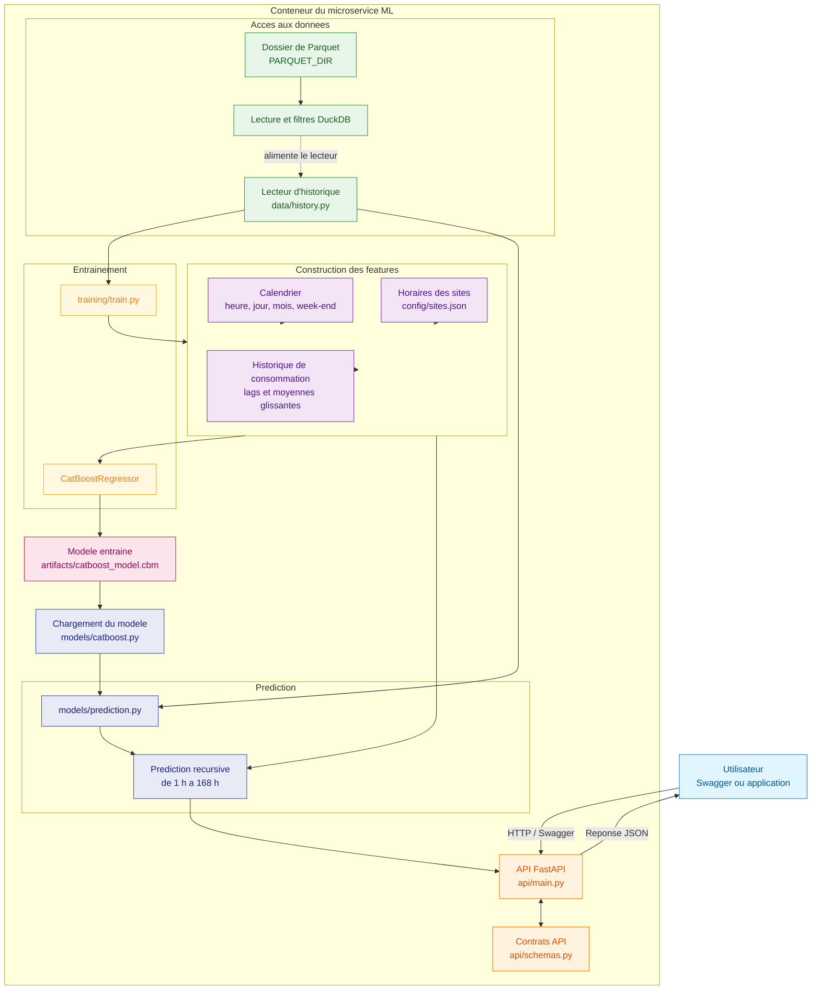
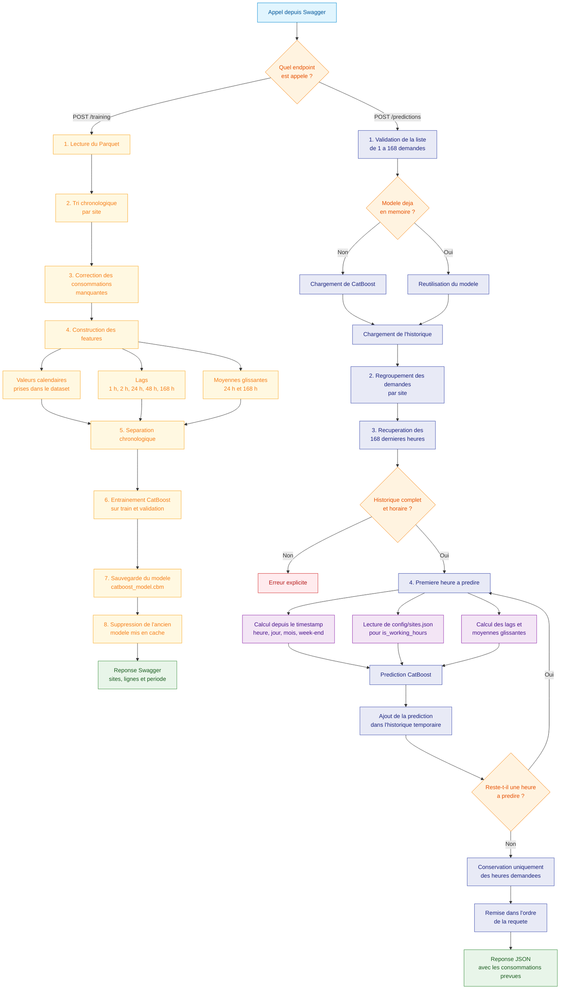
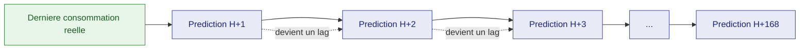

# Service ML EnerVision

Ce service entraine un modele CatBoost puis expose des predictions horaires
avec FastAPI.

## Configuration

Trois variables d'environnement permettent d'indiquer les fichiers a charger :

```text
PARQUET_DIR=datas/parquets
ML_MODEL_PATH=artifacts/catboost_model.cbm
ML_SITE_CONFIG_PATH=config/sites.json
```

`PARQUET_DIR` pointe un dossier contenant un ou plusieurs fichiers `.parquet`
ou `.pq`, produits par l'ETL (partition `site_id=...`). Ils sont lus ensemble
avec DuckDB, y compris dans les sous-dossiers.

Les colonnes attendues sont `site_id`, `site_type`, `timestamp`,
`consumption_kwh`, `hour`, `day_of_week`, `month`, `is_weekend` et
`is_working_hours`. Chaque site doit posseder au moins 168 heures consecutives.
Pour une prediction future, les quatre premieres valeurs calendaires sont
calculees depuis le timestamp et les heures ouvrees viennent de
`config/sites.json`.

## Demarrage

Depuis `apps/ml` :

```bash
uv sync --dev
uv run ml-api
```

`ml-api` est un raccourci defini dans `apps/ml/pyproject.toml`.

La documentation interactive est disponible sur `http://localhost:8000/docs`.

## Notebook Jupyter

Depuis `apps/ml`, installer les dependances puis lancer Jupyter Lab :

```powershell
uv sync --dev
uv run jupyter lab
```

Jupyter affiche son URL dans le terminal. Deux carnets, deux questions :

| Carnet | Question | Produit |
|---|---|---|
| `model_selection.ipynb` | quel algorithme, quelles variables | la configuration reproduite par `training/train.py` |
| `impact_kpi.ipynb` | ce que le modèle fait gagner à l'exploitant | deux KPI métier, repris dans [`docs/ml.md`](../../docs/ml.md) |

`impact_kpi.ipynb` rejoue la prévision sur le bloc de test. Il charge le modèle **depuis le registre
MLflow**, par son alias `champion`, donc il mesure celui que l'API sert : lancer `POST /training` au
moins une fois avant. Ses chemins d'entrée sont groupés dans la première cellule de code.

## Insights

Apercu de la qualite et de l'evolution des mesures, depuis `apps/ml` (necessite
`PARQUET_DIR` dans `.env`) :

```powershell
uv sync --dev
uv run python notebooks/insights/prepare_data.py
uv run python notebooks/insights/build_html.py
```

Ouvrir ensuite `notebooks/insights/apercu_sites_001_003.html` dans un navigateur.

## Docker

Construire l'image depuis `apps/ml` :

```bash
docker build -t enervision-ml .
```

Le dossier Parquet n'est pas inclus dans l'image. Il est monte en lecture
seule, et le dossier `artifacts` en ecriture pour recevoir le modele entraine :

```powershell
docker rm -f enervision-ml
New-Item -ItemType Directory -Force artifacts

docker run -d `
  --name enervision-ml `
  -p 8000:8000 `
  -e PARQUET_DIR=/data `
  --mount "type=bind,source=$((Resolve-Path '.\datas\parquets').Path),target=/data,readonly" `
  --mount "type=bind,source=$((Resolve-Path '.\artifacts').Path),target=/app/artifacts" `
  enervision-ml
```

Ouvrir ensuite `http://localhost:8000/docs`, appeler `POST /training`, puis
utiliser `POST /predictions`. L'entrainement peut durer plusieurs minutes.

## Entrainement

`POST /training` ne demande aucun corps JSON. Il charge les deux dernieres
annees disponibles, reproduit la preparation et la configuration finale du
notebook, puis ecrit
`artifacts/catboost_model.cbm`. Le modele est recharge automatiquement lors de
la prediction suivante.

## Prediction

`POST /predictions` relit l'historique a chaque appel afin d'utiliser les
mesures les plus recentes. Avec les Parquet, DuckDB ne selectionne que les sites
demandes et leur historique recent. Seuls le modele CatBoost et la configuration
des horaires restent en memoire.

Deux conditions sont verifiees pour chaque site avant la premiere prediction :

1. les 168 dernieres heures d'historique doivent etre presentes, consecutives
   et exploitables apres le nettoyage des donnees ;
2. la derniere heure demandee doit se situer au maximum 168 heures apres la
   derniere mesure historique connue.

La recursion commence uniquement apres cette validation. Les valeurs historiques
corrigees par forward fill restent des donnees historiques : elles ne proviennent
jamais d'une prediction du modele.

Il recoit directement une liste de 1 a 168 demandes :

```json
[
  {"site_id": "SITE001", "date": "2025-01-01", "hour": 1},
  {"site_id": "SITE001", "date": "2025-01-01", "hour": 2}
]
```

La reponse conserve le meme ordre :

```json
[
  {
    "site_id": "SITE001",
    "timestamp": "2025-01-01T01:00:00",
    "consumption_kwh": 112.4
  },
  {
    "site_id": "SITE001",
    "timestamp": "2025-01-01T02:00:00",
    "consumption_kwh": 115.1
  }
]
```

Les heures manquantes entre la derniere mesure et une demande sont predites en
interne. Une prediction devient ainsi l'historique de la suivante, sans jamais
utiliser une consommation future reelle.

Chaque entraînement enregistre une version dans le registre MLflow et lui repose l'alias
`champion` ; c'est cette version que la prédiction charge.

## Tests et couverture

Depuis `apps/ml`, lancer :

```powershell
uv sync --dev
uv run pytest
```

Pytest affiche le detail de la couverture des fichiers de `src`. Le seuil
minimal est fixe a 80 % dans `pyproject.toml` : la commande echoue
automatiquement si la couverture descend sous ce niveau.

## Architecture du microservice

Le microservice possede deux responsabilites principales : entrainer un modele
CatBoost a partir de l'historique et utiliser ce modele pour produire des
predictions horaires.



Les features proviennent de trois sources :

1. le timestamp cible pour l'heure, le jour de la semaine, le mois et le week-end ;
2. `config/sites.json` pour les heures ouvrees de chaque site ;
3. l'historique de consommation pour les lags et les moyennes glissantes.

## Flux des appels API

Le flux se separe selon l'endpoint appele depuis Swagger.



## Prediction recursive

Pour produire plusieurs heures, CatBoost avance une heure apres l'autre.
Chaque prediction devient une valeur disponible pour construire les lags de
l'heure suivante.



> Le modele predit la premiere heure, puis utilise cette prediction comme si
> elle faisait partie de l'historique pour calculer l'heure suivante.
