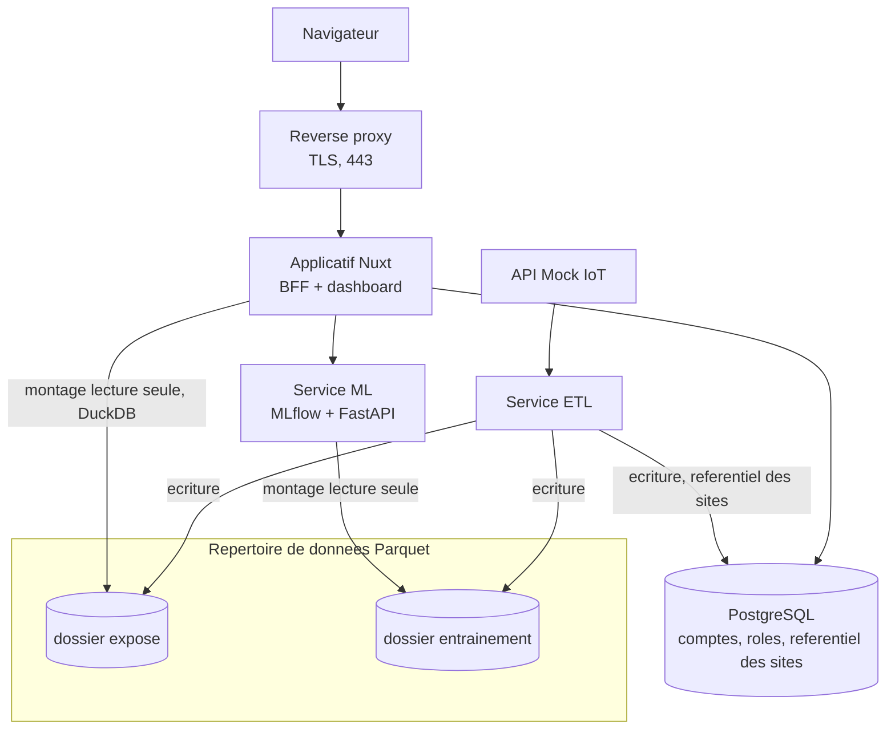
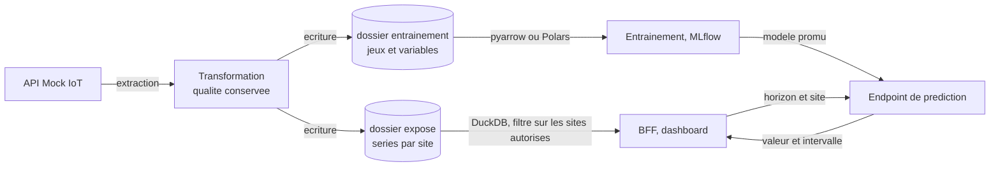
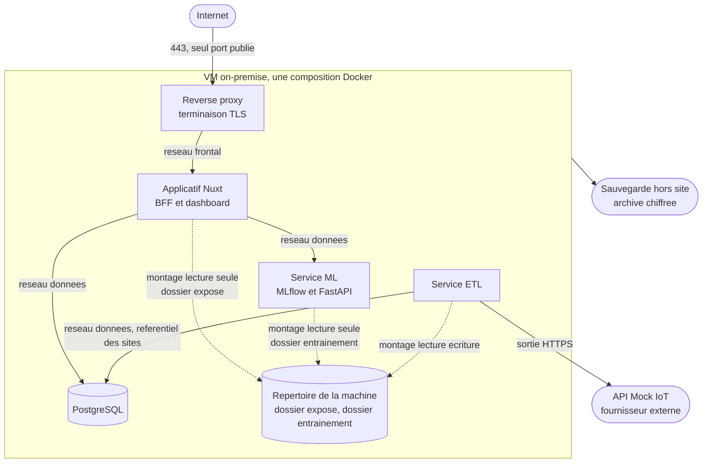
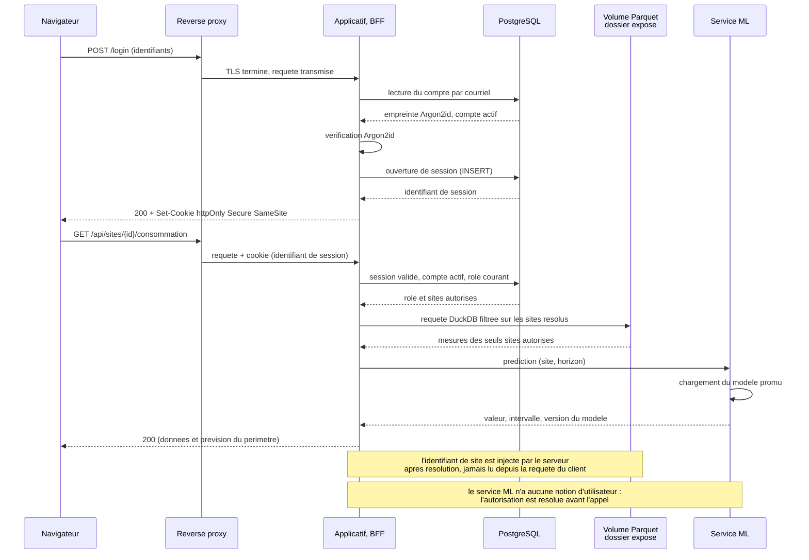

# Architecture EnerVision

Référence commune de l'équipe, figée le **lundi 14 septembre 2026** lors de la séance de cadrage du J1 (issue #98), à partir des cinq dossiers de conception individuels.

**Ce fichier est la source de vérité de l'architecture**, et il n'en existe pas de seconde : toute autre copie est un export, jamais l'original. Toute évolution s'y écrit le jour où elle est décidée, avec sa raison, et la section « Points tranchés depuis » garde la trace de ce qui a changé, parce qu'une décision effacée est une décision qui se rediscute. Les tickets qui réalisent ces décisions vivent dans le projet GitHub.

## Principes retenus

1. **Tout est hébergé sur la VM on-premise.** Aucune donnée d'exploitation ne sort. L'hybride a été écarté explicitement.
2. **Tout est conteneurisé**, pour qu'une brique puisse basculer vers un fournisseur cloud plus tard sans réécriture.
3. **Un seul point d'entrée public**, le reverse proxy. Aucun autre service n'est joignable de l'extérieur.
4. **L'autorisation vit dans l'applicatif.** L'ETL et le ML n'ont aucune notion d'utilisateur.
5. **Une seule écriture de la donnée transformée**, lue par deux consommateurs. Pas de duplication.
6. **Le plus simple qui fonctionne.** Ce qui n'est pas nécessaire au MVP est documenté comme évolution, pas construit.

## Vue d'ensemble

## Les briques

| Brique | Techno | Responsabilité | Exposition |
|---|---|---|---|
| Reverse proxy | Caddy ou Traefik, à confirmer | Terminaison TLS, porte d'entrée unique, en-têtes de sécurité, limitation de débit | Public, 443 |
| Applicatif | Nuxt, Vue 3, TypeScript | Dashboard, BFF, authentification, autorisation, règles métier, recommandations. Architecture en couches en interne | Réseau interne |
| ETL | Python | Extraction depuis l'API Mock, nettoyage, transformation, écriture Parquet, chargement du référentiel des sites en base | Réseau interne |
| ML | Python, MLflow, FastAPI | Entraînement, registre de modèles, endpoint de prédiction | Réseau interne |
| Base relationnelle | PostgreSQL | Comptes, rôles, référentiel des sites et leurs réglages. Rien d'autre | Réseau interne |
| Stockage des mesures | Fichiers Parquet, dans un répertoire de la machine | Deux sous-répertoires : séries exposées, jeux d'entraînement | Montages |

## Données

**Format.** Fichiers Parquet partitionnés par site, puis par période. **Le contrat est le format, pas la bibliothèque qui le lit** : Parquet est un format ouvert, et chaque service choisit son outil. Côté Python, `pandas.read_parquet()` suffit : il rend directement le tableau de données que scikit-learn ou Prophet attendent, il délègue à pyarrow, et il accepte `columns` et `filters`, donc il ne lit ni les colonnes ni les partitions dont on n'a pas besoin. Polars ou `pyarrow.dataset` prennent le relais le jour où un jeu dépasserait la mémoire, ce que sept sites et quelques dizaines de mégaoctets ne feront pas. Côté applicatif, **DuckDB** fait le SQL et les agrégats que le tableau de bord demande, par son API Node officielle `@duckdb/node-api` : c'est du TypeScript, pas une dépendance Python, et c'est de loin le meilleur lecteur Parquet de l'écosystème JavaScript.

Dans tous les cas c'est une **bibliothèque embarquée dans le service**, jamais un serveur : il n'existe pas de serveur DuckDB, et l'interface entre les services est le fichier, pas un processus.

**Où vivent les fichiers.** Un **répertoire de la machine**, monté dans les conteneurs qui en ont besoin. Pas un volume Docker nommé : un répertoire de l'hôte se liste, se sauvegarde et s'inspecte avec les outils du système, ce qui compte pour la sauvegarde chiffrée hors site et pour diagnostiquer sans entrer dans un conteneur.

Le chemin arrive par **variable d'environnement** dans chaque service, et c'est le **playbook Ansible** qui crée le répertoire et pose ses droits avant que la pile ne démarre. Rien n'est créé à la main sur la machine, pas même un dossier.

**Le temps réel ne passe pas par là.** L'état instantané d'un capteur est demandé directement à l'API Mock par l'applicatif : le passer par l'ETL et les fichiers ajouterait la latence d'un cycle d'ingestion à une donnée dont tout l'intérêt est d'être fraîche. Les fichiers Parquet portent l'**historique nettoyé**, c'est-à-dire ce qui se trace, s'agrège et sert à entraîner.

**Deux répertoires, deux usages.** Le répertoire exposé alimente le dashboard, celui d'entraînement alimente le modèle. L'ETL est le seul à écrire ; chaque consommateur ne monte que son répertoire, en lecture seule. Un composant ne peut pas lire ce qui n'est pas monté dans son conteneur.

**Schéma.** Un répertoire de fichiers n'impose aucun schéma : une base refuserait une colonne au mauvais type, un fichier l'accepte et c'est le lecteur qui casse, plus tard et ailleurs. Trois règles compensent, détaillées dans [`data.md`](./data.md) : le schéma est **déclaré** à l'écriture et jamais déduit des données du moment, l'écriture est **atomique**, et un test du pipeline compare le schéma produit au schéma de référence.

**Qualité.** Les mesures sont stockées telles que l'API Mock les renvoie, avec leurs indicateurs de qualité, et jamais filtrées. Valeur brute et valeur imputée restent distinctes. Un agrégat qui exclut des sites le signale à l'écran.

**Traçabilité du modèle.** Assurée par **MLflow seul**, sans second outil. Chaque exécution d'entraînement enregistre ses paramètres, ses métriques et la **fenêtre temporelle** du jeu utilisé. Cela suffit à rattacher un modèle à l'état exact des données qui l'a produit, parce que l'ETL écrit de façon incrémentale et ne réécrit jamais une période déjà close : une fenêtre de dates désigne donc toujours le même contenu. Aucune donnée n'est dupliquée pour être versionnée.

**Données personnelles.** Les mesures de consommation sont des données d'entreprise. Les seules données personnelles sont les comptes utilisateurs, qui vivent dans PostgreSQL et ne quittent jamais la machine.

## Flux

## Déploiement

Une machine, une composition Docker, **un seul port publié** : le 443 du reverse proxy. Aucun autre service n'est joignable depuis le réseau.

**Deux réseaux internes, et pas un de plus.** Le réseau frontal ne relie que le proxy et l'applicatif : le proxy ne peut donc joindre ni la base, ni le service de prédiction, ni le volume. Le réseau données relie l'applicatif à PostgreSQL et au service ML, ainsi que l'ETL à PostgreSQL pour le seul référentiel des sites (voir « Points tranchés »). Un service compromis ne voit que ce que son réseau lui laisse voir.

**L'ETL rejoint le réseau données, mais seulement pour le référentiel des sites.** Il écrit les sites qui manquent dans PostgreSQL ; il n'appelle ni l'applicatif ni le service ML, et il ne gagne aucune notion d'utilisateur, de compte ou de session. Il continue par ailleurs à ne parler qu'à l'API Mock en sortie, et son lien principal avec le reste du système reste le volume, en montage, pas en route.

**Les traits pleins sont des réseaux, les pointillés des montages.** La distinction est le cœur du cloisonnement : une route se contrôle dans du code, un montage se lit dans le fichier de composition. Le service ML ne peut pas lire les séries exposées parce que ce répertoire n'est pas monté dans son conteneur, et cela se vérifie sans exécuter le programme.

## Séquence d'un appel authentifié

Une connexion, puis une lecture filtrée assortie d'une prévision. C'est le chemin complet, celui qui met en jeu tous les composants.

**Deux propriétés se lisent sur ce schéma.** La première : le périmètre n'est jamais fourni par le client. Il est résolu depuis la session, côté serveur, et injecté dans la requête de données ; un identifiant de site reçu du navigateur ne sert qu'à être comparé au périmètre autorisé. La seconde : l'autorisation est entièrement résolue **avant** l'appel au service de prédiction, qui ne reçoit qu'un site et un horizon. C'est ce qui permet au service ML de n'avoir aucune notion d'utilisateur.

Le jeton n'est jamais lisible par un script : il vit dans un cookie `httpOnly`, `Secure`, `SameSite`, et la couche serveur de l'applicatif est seule à le manipuler.

## Sécurité

- **Un seul port public**, le 443 sur le reverse proxy. Aucun port des services internes n'est publié sur l'hôte.
- **Session** : cookie httpOnly, Secure, SameSite. Le jeton n'est jamais lisible par un script.
- **Cloisonnement par site** : le rôle et la liste des sites autorisés sont résolus côté serveur, à partir de la session, et **injectés** dans la requête de données. Un identifiant de site reçu du client est comparé au périmètre autorisé, il ne sert jamais de source. Une seule fonction rend cette liste et le filtre est toujours appliqué, y compris pour un administrateur, à qui elle rend la liste complète.
- **Rôles** : trois au schéma, **`ADMIN`, `OPERATOR`, `VIEWER`**, et un seul vocabulaire dans tout le projet. La table existe et le mécanisme est en place, mais **un seul rôle est exploité au MVP**, `ADMIN`. Les rôles restreints sont montrés à l'oral et se lisent dans les tests, pas construits.
- **Secrets** : SOPS et age pour ce qui est versionné, chaque membre et la CI ayant sa clé ; secrets de la forge pour la CI. Une procédure écrite permet à chacun de chiffrer et déchiffrer sans assistance.
- **Machine** : accès SSH par clé, compte mutualisé donc aucun secret en clair déposé et **aucun commit depuis la VM**, l'historique devant rester nominatif.

## Dépôt et conventions

**Monorepo.** Un répertoire par service applicatif, chacun avec son fichier Docker et sa documentation ; une composition à la racine ; un répertoire d'infrastructure (Ansible) ; un répertoire de workflows d'intégration continue.

**Branches.** Une seule branche durable. Une branche par ticket, nommée selon la convention imposée, créée depuis la carte du Kanban. Une tâche tient dans la journée.

**Revue.** Chaque domaine a un relecteur désigné, responsable de son périmètre ; un second relecteur est facultatif. C'est aussi le mécanisme de partage de compétences de l'équipe.

**Intégration continue.** Lint, tests, scan de sécurité (Trivy sur les dépendances, les images et les secrets, bloquant), construction des images. **Le déploiement est déclenché explicitement**, uniquement depuis la branche principale et seulement si tout ce qui précède est vert.

**Exploitation.** Rien n'est modifié à la main sur la VM : le pipeline est le seul chemin. On développe sur son poste, la machine ne reçoit que ce qui vient du pipeline. L'exception admise est l'exploitation (lancer, lire des logs, diagnostiquer), jamais l'édition de code.

**Documentation.** Ce fichier pour la vue d'ensemble, un document par service pour ses endpoints, ses variables d'environnement et son démarrage. Diagrammes en Mermaid dans les fichiers, jamais en image collée : ils doivent rester corrigeables jusqu'à la soutenance.

## Hors périmètre du MVP, documenté comme évolution

| Sujet | Raison du report |
|---|---|
| Stockage objet local compatible S3 | Un service permanent de plus, non justifié à cette volumétrie. DuckDB lit un chemin local et une adresse d'objet de la même façon : la bascule est un changement de chaîne de connexion. |
| Distribution du calcul (Ray) | Sept sites et quelques dizaines de mégaoctets ne donnent rien à distribuer. Les traitements sont écrits sans état partagé pour que la bascule reste possible. |
| Terraform | Pas d'API de fournisseur à piloter sur une VM unique. Ansible couvre le besoin réel, la configuration de la machine. |
| Kubeflow | Même logique que Terraform, côté chaîne ML. MLflow suffit au MVP. |
| **Plusieurs entreprises clientes** | Le MVP sert un client pilote. Les sites portent le cloisonnement, ce qui suffit à le démontrer ; une table entreprise serait une dimension sans données, la source n'en fournissant aucune. |
| **Format de table (Delta Lake, Iceberg)** | Un journal de transactions par-dessus les Parquet règlerait d'un coup le schéma imposé, l'écriture atomique et l'historique des versions des jeux. C'est le « plus tard » le mieux justifié de cette table. Écarté parce qu'une couche de métadonnées de plus se comprend et se débogue, et que les trois propriétés s'obtiennent autrement pour le MVP. |
| **DVC** | MLflow versionne déjà modèles, paramètres et métriques, et la fenêtre temporelle du jeu suffit à identifier les données, l'ETL étant incrémental. Un second outil de versionnement pour une propriété déjà tenue. |
| **Rôles restreints exploités** | Le mécanisme et la table existent ; les distinguer dans l'interface multiplierait les cas de test des règles métier sans rien ajouter à la démonstration. |

## Points ouverts

1. **Reverse proxy** : acté, mais absent du schéma proposé en séance. À harmoniser.
2. **Contrats d'interface** des trois services : séance prévue au J2, avant tout développement parallèle.
3. **Protection de la branche principale** : impossible tant que le dépôt est privé sur une organisation en offre gratuite. Décision à prendre sur le passage en public.
4. **Supervision** : Prometheus et Grafana prévus, pas encore positionnés dans le schéma.

## Points tranchés depuis

**Accès aux données : montages, et non service.** Tranché le mardi 15 septembre 2026. Le schéma proposé en séance de cadrage faisait des fichiers Parquet un service interrogé par les autres briques ; c'est la lecture directe qui l'emporte. Chaque consommateur lit directement les fichiers d'un volume Docker partagé, avec la bibliothèque de son choix, et l'ETL est seul à le monter en écriture.

Les raisons : un service de plus à construire et à maintenir dans un MVP de dix jours ; un service ML qui récupérerait ses jeux d'entraînement par HTTP, cas où une API coûte sans rien apporter puisque le fichier se lit sans copie ; et surtout un cloisonnement qui redeviendrait du code applicatif au lieu de tenir dans les montages du fichier de composition, donc vérifiable sans lire une ligne de programme.

**DuckDB est bien une bibliothèque, et le stockage un répertoire.** Tranché le mardi 15 septembre 2026, après vérification. Le doute venait de là : « je n'étais pas sûr que DuckDB soit en capacité de fournir une information directement, et que du coup il était obligé d'avoir un conteneur ». Il ne l'est pas. On l'interroge comme on interrogerait PostgreSQL, depuis le processus qui l'embarque.

Et les fichiers vivent dans un répertoire de la machine, pas dans un volume Docker nommé ni dans un conteneur. L'ETL et le service ML sont donc colocalisés, **par simplicité et non par contrainte** : le jour où il faudrait les séparer, passer les fichiers sur un stockage objet lève la contrainte sans toucher au code, DuckDB et pandas lisant un chemin local et une adresse d'objet de la même façon.

**Un seul client, cloisonnement par site.** Tranché le mardi 15 septembre 2026, au daily. Le MVP sert un client pilote : il n'y a pas de table entreprise, et la dimension de cloisonnement est le site. Les fichiers Parquet sont partitionnés par site, et le périmètre d'un compte est une liste de sites.

Le motif est qu'une table entreprise serait une dimension sans données : l'API Mock ne renvoie que des sites, et toute correspondance site vers entreprise serait inventée. Le cloisonnement se démontre aussi bien sur des sites, et il se teste avec moins de cas.

**Rôles : le mécanisme, pas les profils.** Tranché le même jour. La table des rôles et la résolution côté serveur existent, mais un seul rôle est exploité au MVP. Les profils restreints se montrent à l'oral et se lisent dans les tests, plutôt que de multiplier les règles métier à vérifier en deux semaines.

**DVC écarté.** Tranché le même jour. Voir la table du hors périmètre ci-dessus : MLflow tient déjà la propriété recherchée.

**L'ETL gagne un accès en écriture à PostgreSQL, strictement borné au référentiel des sites.** Tranché le mardi 15 septembre 2026. Le référentiel des sites vient de l'API Mock, et l'ETL est le seul service qui l'interroge : le faire écrire les sites manquants directement dans la table `sites` évite de dupliquer cet appel côté applicatif ou d'ajouter un service intermédiaire pour une simple synchronisation d'ajout. L'ETL rejoint donc le réseau données, en écriture d'ajout uniquement sur cette table (les sites déjà répertoriés ne sont ni modifiés ni supprimés par ce chemin).

Cela ne revient pas sur le reste du cloisonnement : l'ETL n'a toujours aucune notion de compte, de rôle ou de session, n'appelle ni l'applicatif ni le service ML, et la table `sites` reste créée et administrée ailleurs (migration dédiée, hors périmètre ETL).

## Où trouver le reste

- `data.md` : le modèle relationnel et le contrat des fichiers Parquet. **Arrive séparément**, le schéma relationnel demandant encore un tour de relecture ; l'index de `docs/` l'annonce déjà.
- [`README.md`](./README.md) : ce que contient chaque document et pour quelle épreuve.
- Le document de chaque service, dans `apps/<service>/README.md` : ses entrées, ses sorties, son démarrage.
