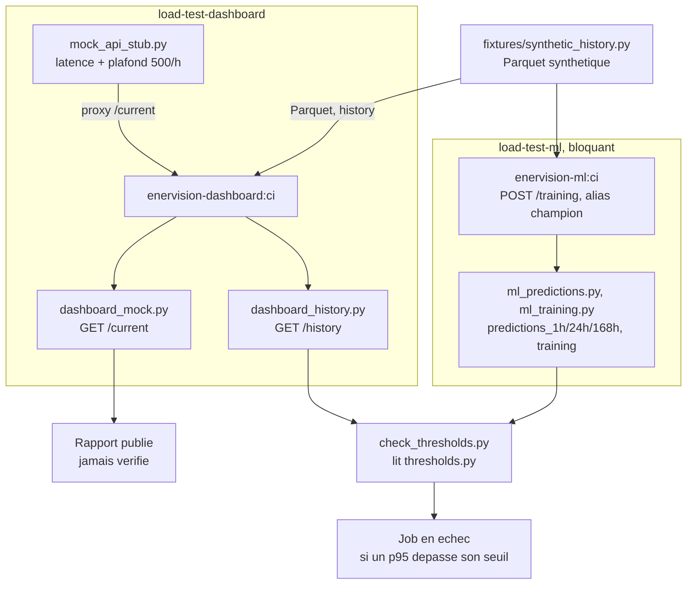

# Le pipeline

Trois workflows GitHub Actions gardent la branche principale. Ce document dit ce qu'ils font, dans quel ordre, ce que chaque étape bloque, et **ce qu'ils ne font pas** : une chaîne verte dont personne ne connaît les angles morts rassure sans protéger.

Un lecteur qui n'a pas écrit ces fichiers doit pouvoir rejouer une étape sur son poste et diagnostiquer un échec sans demander d'aide.

## Les trois workflows

| Fichier | Nom affiché | Déclencheur | Ce qu'il vérifie |
|---|---|---|---|
| [`.github/workflows/ci.yml`](../.github/workflows/ci.yml) | CI | pull request vers `main`, et push sur `main` | Lint, types, tests, validation de la composition, construction **et scan** des images |
| [`.github/workflows/security.yml`](../.github/workflows/security.yml) | Sécurité | **tout** push, sur n'importe quelle branche | Vulnérabilités, secrets dans l'arbre et dans l'historique, cohérence du chiffrement SOPS |
| [`.github/workflows/deploy.yml`](../.github/workflows/deploy.yml) | CD | lancement manuel (suspendu depuis la reprise en solo : plus de runner sur la VM, le déclencheur sur fin de `CI` revient avec Kubernetes) | Exécution locale du playbook Ansible sur la VM |

La séparation n'est pas cosmétique : un secret poussé par erreur ne doit pas attendre une pull request pour être détecté, donc `Sécurité` tourne dès le premier push. Le reste coûte des minutes de runner et reste attaché aux pull requests.

`Sécurité` n'a **pas** de déclencheur `pull_request`, délibérément : les checks s'attachent au commit, pas à l'événement qui les a lancés, et un run déclenché par push apparaît déjà sur la pull request. Ajouter `pull_request` produirait deux runs sur le même commit, dont `concurrency` annulerait l'un ; le check annulé resterait affiché en échec indéfiniment.

## Le filtrage par chemin

Le premier job de `ci.yml`, `changes`, compare les fichiers modifiés à cinq ensembles avec [`dorny/paths-filter`](https://github.com/dorny/paths-filter). Les autres jobs s'y conditionnent : un correctif sur l'applicatif ne relance ni l'ETL ni le service ML.

| Domaine | Chemins écoutés | Jobs déclenchés |
|---|---|---|
| `etl` | `apps/etl/**` | `etl`, `image-etl` |
| `ml` | `apps/ml/**` | `ml`, `image-ml`, `load-test-ml` |
| `dashboard` | `apps/dashboard/**` | `dashboard`, `image-dashboard`, `load-test-dashboard` |
| `infra` | `infra/**`, `docker-compose.yml` | `infra` |
| `loadtest` | `load-tests/**` | `load-test-ml`, `load-test-dashboard` |

Les cinq écoutent aussi `.github/workflows/ci.yml` lui-même, sans quoi une pull request qui ne touche que la CI ne déclencherait aucun job, exactement le moment où l'on voudrait une preuve.

Le job `changes` interroge l'API des fichiers modifiés, d'où `pull-requests: read` dans `permissions` : sans elle, il échoue en « Resource not accessible by integration » et bloque tout le pipeline, puisqu'il conditionne les autres jobs.

## Les étapes, dans l'ordre, et ce que chacune bloque

L'enchaînement est **par domaine** : lint, puis tests, puis construction de l'image. Chaque étape échoue le job, et un job en échec bloque la fusion.

| Ordre | Étape | Où | Ce qu'elle bloque | État |
|---|---|---|---|---|
| 1 | Lint | `eslint` (dashboard), `ruff` (ETL, ML) | Une violation de règle | En place, bloquant partout |
| 1 bis | Formatage | `ruff format --check` | Un fichier Python non formaté | En place pour le Python. Différé côté TypeScript |
| 2 | Types | `dashboard` : `vue-tsc` | Une erreur de typage | En place |
| 3 | Tests | `dashboard` : `vitest` ; `etl`, `ml` : `pytest` | Un test rouge | En place |
| 4 | Composition | `infra` : `docker compose config` | Un `docker-compose.yml` invalide | En place |
| 5 | Images | `image-*` : `docker build`, puis Trivy | Un Dockerfile cassé, une vulnérabilité **critique** dans l'image | En place |
| 6 | Charge et performance | `load-test-ml`, `load-test-dashboard` : Locust | Un dépassement de seuil sur `/predictions`, `/training`, l'historique du dashboard. **Jamais** sur l'accès à l'API Mock (voir plus bas) | En place |
| 7 | Scan du code | `security.yml` : Trivy, gitleaks, SOPS | Une vulnérabilité critique **ou élevée**, un secret, un destinataire oublié | En place, hors chaîne (voir plus bas) |
| 8 | Déploiement | `deploy.yml` sur le runner de la VM | Ne s'exécute qu'après une CI verte sur `main` | Suspendu depuis le 29 septembre 2026 (VM de l'école abandonnée) |

Les tests passent avant la construction de l'image : les tests ne tournent pas dans l'image, et la construire avant de savoir si le lint passe achète des minutes de runner contre rien.

`nuxt.config.ts` pose `typeCheck: false` : ni `nuxt build` ni `eslint` ne regardent les types, l'étape 2 (`vue-tsc`) est la seule à le faire.

Les tests de l'applicatif démarrent eux-mêmes un `postgres:16-alpine` par Testcontainers ; le démon Docker du runner suffit, aucun service n'est déclaré dans le workflow.

## Les linters et le rapport qualité

Un jeu de règles par langage, versionné, et le pipeline échoue sur une violation.

| Langage | Outil | Configuration | Bloquant |
|---|---|---|---|
| Python | `ruff` 0.16.8 | [`ruff.toml`](../ruff.toml), à la racine, commun aux deux applications | Oui |
| TypeScript, Vue | `eslint` via `@nuxt/eslint` | [`apps/dashboard/eslint.config.ts`](../apps/dashboard/eslint.config.ts) | Oui |

`ruff` est épinglé en version : son jeu de règles par défaut change d'une version à l'autre, et une CI qui rougit parce qu'un outil s'est mis à jour tout seul apprend à l'équipe à l'ignorer.

SonarQube Cloud analyse aussi le dépôt, en dehors de ces workflows. Bilan de la première analyse : [`rapports/2026-09-23-sonar.md`](./rapports/2026-09-23-sonar.md).

`--output-format github` annote les lignes fautives directement dans l'onglet « Files changed » de la pull request, plutôt que d'obliger à ouvrir le log pour savoir où regarder.

### Les règles désactivées, et pourquoi

Trois exceptions, chacune motivée dans `ruff.toml` à l'endroit où elle est posée.

| Règle | Portée | Motif résumé |
|---|---|---|
| `DTZ001` | Répertoires de tests | Exige un fuseau sur tout `datetime`, pour du code qui compare des horodatages réels : `datetime(2025, 1, 1, 12)` dans un test dit « midi », pas « midi à Paris ». Reste active partout ailleurs |
| `UP017` | Tout le dépôt | `datetime.timezone.utc` → `datetime.UTC`, deux formes exactes. 64 occurrences pour un synonyme, la moitié du diff d'une mise en place d'outil |
| `N812` | Deux lignes, par `noqa` | `psycopg2` expose son type de connexion en minuscules ; l'aliaser en `Connection` est la forme conventionnelle |

Le reste du jeu `UP` est conservé : il attrape de vraies tournures dépassées.

### Le formatage

`ruff format`, vérifié en CI par `ruff format --check`. Sur un poste, `ruff format apps/ml apps/etl` avant de commiter suffit.

**Côté TypeScript, pas encore automatisé** : activer les règles stylistiques de `@nuxt/eslint` reformaterait tout le dashboard, en collision avec les branches en cours dessus. Pull request dédiée quand elles auront atterri.

### Le rapport

Chaque job de lint produit, en `if: always()` :

- un **résumé** dans `$GITHUB_STEP_SUMMARY`, avec le décompte par règle ;
- un **artefact** `rapport-qualite-<domaine>` (JSON, téléchargeable).

## Construction des images

`image-etl`, `image-ml` et `image-dashboard` : `docker build`, puis Trivy sur l'image, dans le même job. Pas de `login`, pas de `push`, pas de registre. Quota de paquets privés en offre gratuite : 500 Mo, dépassé par la seule image ML (`pandas`, `scikit-learn`, `prophet`, `statsmodels`). Le déploiement reconstruit **sur la machine**.

Conséquence assumée : l'applicatif est construit deux fois sur une pull request qui le touche (`pnpm build` puis l'image), environ deux minutes, le prix d'un Dockerfile réellement vérifié.

## Les mesures de charge et de performance

Deux jobs Locust, dans [`load-tests/`](../load-tests/README.md) : `load-test-ml` et `load-test-dashboard`. Chacun reconstruit son image → démarre dans le runner → historique Parquet **synthétique** ([`fixtures/synthetic_history.py`](../load-tests/fixtures/synthetic_history.py), jamais l'ETL ni l'API Mock réelle) → run Locust headless.



`dashboard_history.py` rejoint le même contrôle de seuils que le service ML, sans tiers en jeu. `dashboard_mock.py` en sort : son rapport est publié, jamais comparé à un seuil, parce qu'il dépend de l'API Mock (ici son stub).

| Job | Scénario | Requêtes nommées | Bloquant |
|---|---|---|---|
| `load-test-ml` | `POST /predictions`, trois horizons | `predictions_1h`, `predictions_24h`, `predictions_168h` | Oui |
| `load-test-ml` | `POST /training` | `training` | Oui |
| `load-test-dashboard` | `GET /sites/{id}/history` (Parquet direct) | `dashboard_history` | Oui |
| `load-test-dashboard` | `GET /sites/{id}/current` (API Mock) | `dashboard_mock` | **Non** |

Les seuils de 95e percentile vivent dans [`load-tests/thresholds.py`](../load-tests/thresholds.py), lus par [`check_thresholds.py`](../load-tests/check_thresholds.py), qui compare au CSV `--csv` de Locust et fait échouer le job sur dépassement — jamais pour `dashboard_mock`, qui n'a pas de seuil.

**`current.get.ts` appelle un tiers externe, et la CI ne l'appelle jamais.** `NUXT_MOCK_API_URL` pointe en CI sur [`load-tests/mock_api_stub.py`](../load-tests/mock_api_stub.py), qui reproduit la latence et le plafond documentés de la source réelle (500 points/heure/client, `docs/api.md`) sans jamais la solliciter : taper sur la vraie API Mock à chaque push consommerait un quota partagé avec le reste de la formation. Constater le bottleneck réel reste un geste manuel, en local (voir `load-tests/README.md`).

Les seuils de départ dans `thresholds.py` sont volontairement larges, faute de mesure réelle au moment où ils ont été écrits ; à resserrer sur un run réel de `ci.yml`, jamais sur une estimation.

## Le scan de sécurité

Trois garde-fous, dans `security.yml`.

**Trivy** couvre trois surfaces en un passage : vulnérabilités des dépendances, secrets versionnés, mauvaises configurations. Réglé sur `CRITICAL,HIGH`, bloquant (`exit-code: 1`), avec `ignore-unfixed: true` : une faille sans correctif publié ne ferait que rendre la CI rouge en permanence.

**gitleaks** couvre l'historique, que Trivy ne voit pas. `-m` compare aussi chaque fusion à ses parents, sans quoi un secret introduit en résolvant un conflit passerait au travers. C'est le binaire qui est utilisé, sous licence MIT ; seule l'action officielle exige une licence payante pour les organisations.

**Le job `secrets`** vérifie que les destinataires de `.sops.yaml` sont exactement ceux du fichier chiffré, puis que la CI sait le déchiffrer : le risque est l'oubli, pas le chiffrement. Procédure complète dans [`secrets.md`](./secrets.md).

Les binaires `sops` et `gitleaks` sont téléchargés puis **vérifiés par somme SHA-256** avant exécution : épingler une version ne dit rien du contenu servi.

### Accepter une vulnérabilité

Corrigée, ou acceptée explicitement — jamais contournée en silence, jamais en retirant `exit-code: 1`.

1. Corriger d'abord : monter la dépendance, ou l'image de base.
2. Sans correctif, ajouter l'identifiant (CVE ou GHSA) dans `.trivyignore`, **avec un commentaire** disant pourquoi c'est acceptable et ce qui la rouvrira.
3. L'acceptation passe par une pull request comme le reste, relue avant fusion.

[`.trivyignore`](../.trivyignore) existe et ne contient aucune exception à ce jour ; il porte la procédure en commentaire.

### Le scan des images

`image-*` passe Trivy sur l'image qu'il vient de construire, en deux fois : un passage affiche `CRITICAL` et `HIGH` sans bloquer, un second échoue sur `CRITICAL`. L'image n'est jamais reconstruite pour ça. Scanner l'image plutôt que le code voit en plus les paquets du système de base, que la couche `FROM` apporte sans qu'aucun fichier du dépôt ne les mentionne.

**Le seuil bloquant y est plus permissif que le scan de code**, qui bloque dès `HIGH`. Ce n'est pas un relâchement : `security.yml` scanne nos dépendances, qu'on choisit et peut monter le jour même ; une image porte en plus les paquets de la base Debian, dont le rythme de correction ne nous appartient pas. Bloquer dessus rendrait la CI rouge en permanence sans que personne ne puisse agir. Les `HIGH` restent affichés, pour qu'aucun ne se découvre le jour où il devient critique.

Un scan dynamique de l'application déployée (OWASP ZAP ou équivalent) reste un plus, pas un attendu.

### Ce que le premier scan a trouvé

Le premier run bloquant a échoué sur les trois images ([run 35203374182](https://github.com/EADL-2026/enerVision/actions/runs/35203374182)) : le garde-fou a trouvé un défaut déjà présent, sans qu'il ait fallu en introduire un.

| Image | Vulnérabilité | Origine | Traitement |
|---|---|---|---|
| ETL, ML | 3 CVE `CRITICAL` dans `perl-base` | Base `python:3.12-slim`, pas encore reconstruite avec le correctif publié par Debian | `apt-get upgrade` à la construction |
| Dashboard | `CVE-2026-59873` dans `tar` 7.5.11 | Le `npm` embarqué dans `node:22-bookworm-slim`, et non nos dépendances : `pnpm-lock.yaml` résout `tar` en 7.5.22 | `npm`, `npx` et `corepack` retirés de l'image d'exécution |

Aucune des deux n'est passée par `.trivyignore` : un correctif existait pour les deux.

**Le cas dashboard justifie ce chapitre.** `security.yml` était vert sur ce même commit : il lit `pnpm-lock.yaml`, où `tar` est déjà en 7.5.22, et n'a aucun moyen de voir la copie que `npm` transporte dans l'image de base. Une faille critique était donc dans l'image livrable sans qu'aucun fichier du dépôt ne la mentionne — exactement ce que le premier critère de #57 demandait de couvrir, démontré sans l'avoir cherché.

## Le déploiement

`CD` écoute la fin de `CI` et ne déploie automatiquement que si elle est verte sur `main`. `workflow_dispatch` rejoue le même déploiement depuis l'interface GitHub, sans pousser de commit.

Le réseau de l'école n'autorise aucune connexion entrante depuis GitHub : pas de clé SSH de déploiement. Le job cible le runner auto-hébergé (`self-hosted`, `linux`, `x64`, `enervision`), installé comme service sur la VM et exécuté par `apprenant`. Le runner appelle GitHub en HTTPS sortant, récupère `main`, puis lance localement :

```bash
ansible-playbook -i infra/ansible/inventory.ini --connection local infra/ansible/playbook.yml
```

Le job passe son propre jeton dans `GH_REPOSITORY_TOKEN` (seule permission `contents: read`), parce que le dépôt est privé et que la machine ne porte aucun identifiant git. Le playbook s'en sert par un en-tête HTTP posé le temps de la récupération du code : rien n'est écrit sur la machine. Il refuse de démarrer sans ce jeton plutôt que de laisser git réclamer un identifiant en cours de tâche.

Deux limites à connaître. Ansible préfixe l'environnement d'une tâche à la commande qu'il lance : l'en-tête est donc visible dans la ligne de commande du processus le temps de la tâche, sur une machine dont le compte est partagé par les cinq — le jeton du job est révoqué dès qu'il se termine. GitHub ne masque que le jeton lui-même, pas l'en-tête qui en dérive : le job le masque explicitement, et la commande Ansible ne doit jamais recevoir `-vvv`, seule verbosité qui l'imprimerait.

Ansible met à jour `/home/apprenant/Projet/enerVision`, injecte les secrets par SOPS, construit les images sur place, applique les migrations et redémarre la composition. Le groupe de concurrence `production` sérialise les déploiements : un second commit attend, il n'interrompt jamais celui en cours.

`Sécurité` reste indépendant : sa conclusion n'est pas un prérequis technique de `workflow_run`. La discipline de revue de `CLAUDE.md` doit donc continuer à exiger les deux contrôles avant la fusion.

**Un déploiement qui échoue laisse la version précédente en place.** Les images sont construites avant que la composition ne redémarre ; si le redémarrage lui-même échoue, l'image précédente est encore présente localement et reste ce que la composition relance.

## Rejouer et diagnostiquer

### Reproduire une étape sur son poste

Chaque étape de la CI a un équivalent local. C'est volontaire : un échec qu'on ne peut reproduire qu'en poussant coûte un aller-retour de cinq minutes par tentative.

| Étape | Commande |
|---|---|
| Lint de l'applicatif | `pnpm --dir apps/dashboard lint` |
| Types | `pnpm --dir apps/dashboard typecheck` |
| Tests | `pnpm --dir apps/dashboard test` (Docker requis, Testcontainers démarre un Postgres) |
| Construction de l'applicatif | `pnpm --dir apps/dashboard build` |
| Validation de la composition | `docker compose config --quiet` |
| Images | `docker build apps/etl`, puis `apps/ml` et `apps/dashboard` |
| Tests ETL, ML | `uv run --directory apps/etl --frozen --no-build pytest`, `uv run --directory apps/ml --frozen --no-build pytest` |
| Charge et performance | Voir [`load-tests/README.md`](../load-tests/README.md) : amorçage, lancement Locust, vérification des seuils |
| Trivy | `docker run --rm -v "$PWD:/src" aquasec/trivy fs --scanners vuln,secret,misconfig --severity CRITICAL,HIGH --ignore-unfixed /src` |
| gitleaks | `gitleaks git . --log-opts="--all -m --full-history" --redact` |
| Scan d'une image | `trivy image --scanners vuln --severity CRITICAL --ignore-unfixed --exit-code 1 enervision-etl:ci`, l'image ayant été construite juste avant |

Le scan de fichiers lancé sur un poste voit des répertoires que la CI ne voit pas, `.claude/` en tête : un worktree local d'une autre branche y apparaît comme une seconde copie du dépôt, d'où des résultats en double — pas un bug. Ajouter `--skip-dirs .claude` pour retrouver la vue de la CI.

La validation de la composition lit le `.env` du poste ; en CI il n'y en a pas, et `docker-compose.yml` déclare plusieurs `${VAR:?message}`, donc le job leur donne des valeurs bidon : la validation porte sur la structure du fichier, jamais sur ce que les variables contiennent.

### Relancer ou suivre un run

```bash
gh run list --limit 10              # les derniers runs et leur état
gh run view <id> --log-failed       # seulement ce qui a échoué
gh run rerun <id> --failed          # relancer les jobs en échec
gh run watch <id>                   # suivre en direct
```

Le bloc `concurrency` annule le run précédent de la même branche quand un nouveau push arrive. Un run marqué « cancelled » sans raison apparente est presque toujours ça, pas une panne.

### Pannes déjà rencontrées

| Symptôme | Cause |
|---|---|
| `Resource not accessible by integration` sur le job `changes` | `pull-requests: read` absent du bloc `permissions` |
| `ERR_PNPM_IGNORED_BUILDS` à la construction de l'image de l'applicatif | pnpm 12 bloque les scripts de build non listés dans `allowBuilds` ; le Dockerfile épingle pnpm 10 |
| Le cache d'une action échoue avant la première commande | L'action calcule sa clé sur un fichier de verrouillage absent |
| Un check reste en échec sur une pull request sans job correspondant | Doublon push et pull request annulé par `concurrency` ; le check annulé ne se met plus à jour |
| **Plus aucun job ne se déclenche sur une pull request**, alors qu'elle en déclenchait avant | La pull request est en conflit avec `main`. GitHub fait tourner les workflows `pull_request` sur la fusion théorique, qu'il ne sait pas calculer tant que le conflit dure : il n'annonce rien, il ne lance simplement plus rien. Fusionner `main` dans la branche rétablit tout |

## Écarts assumés

Ce qui suit est connu, décidé, et non corrigé. C'est ce qui distingue une documentation d'une capture d'écran verte.

| Écart | Pourquoi |
|---|---|
| **Pas de registre d'images** | Quota de 500 Mo pour les paquets privés en offre gratuite, dépassé par la seule image du service ML. Le public exposerait le code. Décidé le 15 septembre 2026 (#50, #107) |
| **`main` n'est pas protégée par règle** | Non activable sur un dépôt privé d'une organisation en offre gratuite. Règle écrite dans [`CLAUDE.md`](../CLAUDE.md) et tenue à la main. Le jour où elle devient activable : **deux** checks obligatoires, `CI` et `Sécurité`, pas un seul — prix du découpage en deux workflows |
| **Un `HIGH` dans une image ne bloque pas** | Seule une `CRITICAL` bloque, là où le scan de code bloque dès `HIGH`. Les paquets de la base Debian ne se corrigent pas à notre rythme ; ils restent affichés dans le log du job |
| **Pas de seuil de couverture bloquant** | Retiré le 16 septembre 2026. Sur dix jours, un seuil non tenu est une CI rouge qui empêche de fusionner : un coût sans contrepartie |
| **Le scan n'est pas dans le graphe de `ci.yml`** | Il tourne sur tout push, donc plus tôt et plus souvent que s'il attendait une pull request. Le chaîner le rendrait plus tardif, pas plus sûr |
| **La CI ne mesure jamais le bottleneck réel de l'API Mock** | `load-test-dashboard` tape sur un stub (`load-tests/mock_api_stub.py`), pas sur la source réelle : quota partagé de 500 pts/h avec la formation. Le constat réel reste un geste manuel, en local |
| **L'applicatif est construit deux fois** | Une fois par `pnpm build`, une fois dans l'image. Environ deux minutes, contre un Dockerfile réellement vérifié |
| **Le formatage TypeScript n'est pas automatisé** | Les règles stylistiques de `@nuxt/eslint` reformateraient tout le dashboard, en collision avec les branches en cours dessus. Pull request dédiée quand elles auront atterri |
| **Le notebook d'exploration n'est pas linté** | `apps/ml/notebooks` est exclu : un notebook garde des cellules dans le désordre et des variables d'essai, trace du raisonnement. Le code qui en sort est repris dans `apps/ml/src`, lui bien linté |
| **Les images ETL et ML mettent à jour leurs paquets à la construction** | Un `apt-get upgrade` applique les correctifs Debian sans attendre la reconstruction du tag amont. Deux images construites à deux jours d'intervalle peuvent donc différer, ce qui affaiblit la reproductibilité. Assumé : un correctif publié doit entrer le jour où il paraît |
| **L'image du dashboard n'a plus `npm`** | Volontaire : un conteneur d'exécution n'installe pas de paquets, et le `npm` de la base transportait une CVE critique. Conséquence à connaître : aucun `npm` ni `npx` dans ce conteneur, `node` seul |
