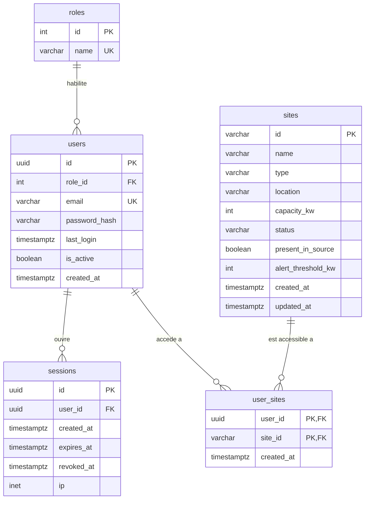

# Modèle de données

Deux stockages, deux rôles, une seule règle de partage : **rien n'est écrit deux fois**.

| Stockage | Contenu | Qui écrit | Qui lit |
|---|---|---|---|
| PostgreSQL | Référentiel des sites, comptes, rôles, périmètres d'accès | L'applicatif, seul | L'applicatif, seul |
| Volume Parquet | Les mesures, transformées | L'ETL, seul | L'applicatif et le service ML, en lecture seule, via DuckDB |

Le pivot entre les deux est `sites.id` : c'est la même chaîne dans PostgreSQL et dans le chemin de partition Parquet. Aucune jointure entre les deux moteurs, seulement une clé partagée.

Voir [`architecture.md`](./architecture.md) pour les principes dont ce document découle.

---

## PostgreSQL : référentiel et habilitations

### `roles`

Les profils d'accès globaux. Trois lignes, injectées au démarrage, jamais créées par l'application.

| Colonne | Type | Contraintes | Description |
| :--- | :--- | :--- | :--- |
| `id` | SERIAL | PRIMARY KEY | Identifiant séquentiel |
| `name` | VARCHAR(50) | UNIQUE, NOT NULL | Libellé normalisé : `ADMIN`, `OPERATOR`, `VIEWER` |

### `users`

| Colonne | Type | Contraintes | Description |
| :--- | :--- | :--- | :--- |
| `id` | UUID | PRIMARY KEY, DEFAULT `gen_random_uuid()` | Identifiant opaque |
| `role_id` | INTEGER | NOT NULL, REFERENCES `roles(id)` ON DELETE RESTRICT | Un utilisateur a un rôle et un seul |
| `email` | VARCHAR(255) | UNIQUE, NOT NULL | Identifiant de connexion |
| `password_hash` | VARCHAR(255) | NOT NULL | Empreinte **bcrypt** |
| `last_login` | TIMESTAMPTZ | NULL | Dernière authentification réussie |
| `is_active` | BOOLEAN | NOT NULL, DEFAULT TRUE | Désactivation sans purge |
| `created_at` | TIMESTAMPTZ | NOT NULL, DEFAULT NOW() | |

`bcrypt` et pas « bcrypt ou Argon2 » : un document de référence qui laisse le choix produit deux implémentations. C'est aussi ce que demande le critère d'acceptation de #29.

### `sessions`

L'état des sessions ouvertes. Le cookie ne porte qu'un identifiant opaque, tout le reste vit ici.

| Colonne | Type | Contraintes | Description |
| :--- | :--- | :--- | :--- |
| `id` | UUID | PRIMARY KEY, DEFAULT `gen_random_uuid()` | Ce que porte le cookie, et rien d'autre |
| `user_id` | UUID | NOT NULL, REFERENCES `users(id)` ON DELETE CASCADE | |
| `created_at` | TIMESTAMPTZ | NOT NULL, DEFAULT NOW() | Ouverture |
| `expires_at` | TIMESTAMPTZ | NOT NULL | Fin de validité, deux heures après l'ouverture |
| `revoked_at` | TIMESTAMPTZ | NULL | Posé à la déconnexion |
| `ip` | INET | NULL | Adresse d'ouverture, pour l'audit |

```sql
CREATE INDEX idx_sessions_user ON sessions (user_id);
```

**Pourquoi une table, et pas le cookie scellé seul.** `nuxt-auth-utils` chiffre les données de session et les place **dans le cookie** : le serveur ne garde rien, et ne peut donc rien révoquer. `clearUserSession` vide le cookie du navigateur, mais une copie prise avant reste valable jusqu'à expiration. Or #29 exige qu'« un cookie rejoué après déconnexion réponde 401, même s'il n'a pas expiré ».

Un JWT ne change rien à cela : c'est le même principe de jeton qui se porte lui-même, en moins confidentiel puisque sa charge utile est seulement signée, donc lisible. La réponse habituelle du monde JWT, la paire accès plus rafraîchissement, suppose de toute façon un jeton long stocké en base et révocable, c'est-à-dire cette table, plus un mécanisme de rotation.

**Ce que la table donne en plus d'un simple compteur sur `users`.** La révocation est par **session**, donc par appareil : se déconnecter d'un poste partagé ne déconnecte pas le téléphone. La liste des sessions actives existe, avec sa date et son adresse, ce qui donne de la matière à l'audit de sécurité (#58). Et un administrateur peut fermer une session.

**Entretien.** Les lignes dont `expires_at` est dépassé sont supprimées à la connexion suivante du même compte. Rien de planifié, rien à surveiller.

**Évolution notée.** Le stockage habituel pour cet usage est Redis : expiration native par clé, révocation par suppression, et état partagé entre plusieurs instances de l'applicatif. Il n'apporte rien ici, où il n'y a qu'une instance et une base qui ne fait rien, et il coûterait un conteneur, un secret et une question de persistance. Le jour où l'applicatif est répliqué, c'est le changement à faire, et il ne touche que la couche de session.

### `sites`

Le référentiel des installations, alimenté depuis `GET /api/v1/sites` et enrichi des réglages faits à l'écran.

| Colonne | Type | Contraintes | Description | Origine |
| :--- | :--- | :--- | :--- | :--- |
| `id` | VARCHAR(16) | PRIMARY KEY | Identifiant technique source (`SITE001`...) | API Mock |
| `name` | VARCHAR(150) | NOT NULL | Nom affiché | API Mock (`site_name`) |
| `type` | VARCHAR(50) | NOT NULL | Nature de l'installation | API Mock (`site_type`) |
| `location` | VARCHAR(100) | NULL | Emplacement, pour l'affichage | API Mock |
| `capacity_kw` | INTEGER | NOT NULL, CHECK (`capacity_kw` > 0) | Puissance souscrite | API Mock |
| `status` | VARCHAR(30) | NOT NULL | État renvoyé par la source | API Mock |
| `present_in_source` | BOOLEAN | NOT NULL, DEFAULT TRUE | Passe à `FALSE` quand le site disparaît de l'API | Déduit |
| `alert_threshold_kw` | INTEGER | NULL, CHECK (`alert_threshold_kw` > 0) | Seuil d'alerte réglé à l'écran Paramètres | Saisie |
| `created_at` | TIMESTAMPTZ | NOT NULL, DEFAULT NOW() | | |
| `updated_at` | TIMESTAMPTZ | NOT NULL, DEFAULT NOW() | Dernier rechargement ou réglage | |

`type` et `status` viennent des critères d'acceptation de **#21**, qui exige de conserver `site_id`, `site_type`, `site_name`, `location`, `capacity_kw` et `status`.

`present_in_source` répond à l'autre critère de #21 : « un site retiré de l'API n'est pas supprimé en base, les mesures historiques restent rattachables ». Une suppression casserait le rattachement des mesures Parquet déjà écrites ; un drapeau le rend visible sans rien perdre.

`alert_threshold_kw` à `NULL` signifie **aucune alerte pour ce site**, pas « seuil par défaut ». Un défaut implicite est une alerte qui se déclenche sans que personne ne l'ait demandée.

Pas de contrainte `CHECK` sur `type` ni sur `status` : leur domaine de valeurs n'est pas encore connu. Un `CHECK` posé sur une hypothèse fait échouer l'ETL sur la première valeur inattendue, et le site est alors perdu au lieu d'être chargé. À poser une fois le domaine relevé sur la source, s'il est stable.

### `user_sites`

Le périmètre d'accès, site par site.

| Colonne | Type | Contraintes | Description |
| :--- | :--- | :--- | :--- |
| `user_id` | UUID | NOT NULL, REFERENCES `users(id)` ON DELETE CASCADE | |
| `site_id` | VARCHAR(16) | NOT NULL, REFERENCES `sites(id)` ON DELETE RESTRICT | |
| `created_at` | TIMESTAMPTZ | NOT NULL, DEFAULT NOW() | Date d'attribution du droit |

Clé primaire composite `(user_id, site_id)`, qui interdit la double attribution.

`ON DELETE RESTRICT` sur `site_id` et non `CASCADE` : un site n'est de toute façon jamais supprimé (cf. `present_in_source`), et un `CASCADE` ferait disparaître des droits en silence si quelqu'un en supprimait un à la main.

### Index

```sql
CREATE INDEX idx_user_sites_site ON user_sites (site_id);
```

La clé primaire couvre déjà la recherche par utilisateur, qui est le cas courant (« quels sites pour cette session »). L'index inverse sert à l'écran d'administration, « qui a accès à ce site ».

### Choix de clés, assumé

Trois stratégies différentes, pour trois raisons différentes : `SERIAL` pour `roles`, référentiel figé de trois lignes ; `UUID` pour `users`, parce qu'un identifiant de compte ne doit pas être devinable ni révéler l'ordre des inscriptions ; `VARCHAR` pour `sites`, parce que c'est la clé de la source et celle du chemin de partition Parquet, et qu'un identifiant technique interne imposerait une table de correspondance pour rien.

Contrepartie de `sites.id` : le format de l'identifiant source entre dans le schéma. Si la source renumérotait, c'est une migration.

---

## Autorisation : une seule fonction, toujours appelée

Le rôle et les sites autorisés sont résolus **côté serveur**, à partir de la session, et injectés dans la requête de données. Un identifiant de site reçu du client est comparé au périmètre autorisé ; il ne sert jamais de source.

**Un seul rôle est exploité au MVP**, `ADMIN` : la table et le mécanisme existent, les profils restreints se montrent à l'oral et se lisent dans les tests plutôt que de multiplier les règles métier à vérifier. Ce qui suit décrit donc le mécanisme complet, dont une seule branche sert aujourd'hui.

`ADMIN` voit tous les sites, sans ligne dans `user_sites`. Cette exception est dangereuse si elle est écrite en ligne dans les requêtes : un `if` inversé donne tout à tout le monde, une ligne manquante donne un tableau de bord vide, et les deux passent les tests heureux. Donc, une règle :

**Le rôle est relu en base à chaque requête, jamais lu dans le cookie.** C'est ce qu'impose le dernier critère de #95 : « retirer un rôle fait échouer l'action correspondante, vérifié, pas supposé ». Un rôle recopié dans un jeton reste vrai jusqu'à l'expiration de ce jeton : rétrograder un administrateur ne changerait rien avant deux heures, et désactiver un compte compromis ne le déconnecterait pas.

Une seule requête suffit et sert les trois vérifications : la session est valide (`revoked_at IS NULL`, `expires_at` non dépassé), le compte est actif (`is_active`), et le rôle est celui d'aujourd'hui.

```sql
SELECT u.id, r.name AS role, u.is_active
  FROM sessions s
  JOIN users u ON u.id = s.user_id
  JOIN roles r ON r.id = u.role_id
 WHERE s.id = $1
   AND s.revoked_at IS NULL
   AND s.expires_at > NOW();
```

**Une seule fonction `sitesAutorises(session)` retourne la liste des sites, et le filtre SQL est toujours appliqué.** Jamais de branche qui saute le `WHERE` pour un administrateur : pour `ADMIN`, la fonction retourne la liste complète, et la requête reste la même. Trois tests unitaires, un par rôle, plus un pour l'utilisateur sans aucun site.

### Cloisonnement par site : tranché

Le MVP sert **un client pilote**, donc pas de table `entreprises` : la dimension de cloisonnement est le site, et le périmètre d'un compte est une liste de sites. Décidé au daily du 15 septembre 2026, et reporté dans [`architecture.md`](./architecture.md).

Le motif : la source ne connaît que des sites, et toute correspondance site vers entreprise serait inventée. Aucun critère d'évaluation ne demande le multi-tenant par entreprise, et le cloisonnement se démontre aussi bien sur des sites, avec moins de cas à tester.

Conséquence directe sur les fichiers Parquet : la clé de partition est `site_id`, pas `entreprise_id`.

---

## Volume Parquet : les mesures

Le détail des colonnes se fige avec l'ETL (#26). Ce qui suit est acté.

### Le schéma est déclaré, jamais déduit

C'est le point le plus facile à rater. `pa.Table.from_pylist(lignes)` **devine** les types à partir du lot qu'on lui donne : un cycle où toutes les consommations sont des entiers ronds produit une colonne entière, et le cycle suivant une colonne flottante. Les deux fichiers s'écrivent sans erreur, et c'est le lecteur qui casse, des jours plus tard, avec un message qui ne désigne pas le coupable.

Le schéma est donc **écrit une fois, dans un module unique**, et l'écriture caste dessus :

```python
SCHEMA = pa.schema([
    ("site_id",               pa.string()),
    ("horodatage",            pa.timestamp("us", tz="UTC")),
    ("consommation_kw",       pa.float64()),   # valeur imputee
    ("consommation_brute_kw", pa.float64()),   # telle que renvoyee, nullable
    ("data_quality",          pa.string()),
    ("null_reasons",          pa.list_(pa.string())),
])

table = pa.Table.from_pylist(lignes, schema=SCHEMA)   # leve si un type ne colle pas
```

Colonnes indicatives : elles se figent avec #26. Ce qui est acté, c'est **qu'il existe un schéma déclaré et un seul**.

Côté lecture, chaque consommateur vérifie ce qu'il reçoit avant de s'en servir. Trois lignes, et une erreur obscure devient un message clair.

La bibliothèque de lecture, elle, appartient à chaque service. Le service ML lit avec `pandas.read_parquet(chemin, columns=..., filters=...)`, qui rend le tableau de données attendu par l'entraînement et ne lit que les colonnes et les partitions demandées ; l'applicatif lit avec DuckDB, parce qu'il a des agrégats à calculer. Les deux lisent les mêmes fichiers.

### L'écriture est atomique

Écriture dans un fichier temporaire, puis renommage. Un fichier Parquet porte son index en **pied de page** : tant qu'il n'est pas écrit, le fichier est illisible. Sans renommage atomique, un lecteur tombera un jour sur un fichier en cours d'écriture, et ce jour-là sera le jour de la démonstration.

Plusieurs lecteurs simultanés ne posent en revanche aucun problème : les fichiers sont immuables une fois écrits.

### Un test du pipeline fige le format

Les deux règles ci-dessus protègent à l'exécution ; celle-ci empêche la régression d'être fusionnée. Un test écrit un lot d'exemple et compare le schéma du fichier produit au schéma de référence. Il échoue dès qu'on touche au format sans le vouloir. Il compte aussi pour C17, tests dans le pipeline.

### Règles de qualité, non négociables

Reprises de `architecture.md` et du document de l'ETL :

- Les mesures sont stockées **telles que l'API les renvoie**, jamais filtrées, même sur un `200` à champs `null`.
- `data_quality` et `null_reasons` sont conservés.
- **Valeur brute et valeur imputée occupent deux colonnes distinctes.** Aucun `null` n'est écrasé sans trace.
- La stratégie d'imputation retenue est documentée avec son risque.
- Un agrégat qui exclut des sites le signale dans sa réponse.

Deux répertoires, deux usages : l'exposé alimente le tableau de bord, celui d'entraînement alimente le modèle. L'ETL est le seul à écrire ; chaque consommateur ne monte que son répertoire, en lecture seule.

---

## Création du schéma

**Tranché le 15 septembre 2026 : Drizzle**, dont le schéma TypeScript est la source de vérité et dont `drizzle-kit migrate` produit les migrations.

Le critère de #26 demande « une migration **rejouable** ». C'est ce qui départage : `drizzle-kit migrate` tient un journal de ce qui a été appliqué et se relance sans risque, là où un `init.sql` monté dans `docker-entrypoint-initdb.d` ne s'exécute **que sur un répertoire de données vide**, donc jamais après le premier démarrage. Et l'applicatif est le seul service à toucher PostgreSQL : le schéma peut lui appartenir entièrement, et les types TypeScript se génèrent depuis lui au lieu d'être recopiés.

Deux conditions à ce choix, parce que l'argument d'en face était bon :

- **Le SQL généré est commité** (`drizzle/0000_*.sql`), pour que le schéma se lise sans connaître l'ORM et qu'une revue porte sur du DDL.
- **Le schéma ne se modifie jamais à la main sur la machine.** Il se modifie dans le schéma TypeScript, la migration est générée, commitée, puis appliquée.

**Amorçage.** Un script idempotent, repris de la proposition de l'applicatif : les trois rôles, les sept sites, et trois comptes de démonstration, un par rôle. Idempotent veut dire qu'un second passage ne crée pas de doublon et n'écrase pas un mot de passe changé depuis.

---

## Données personnelles

Les mesures de consommation sont des données d'entreprise, pas des données personnelles. Les **seules** données personnelles du système sont les comptes et leurs sessions : `users.email`, `users.last_login` et `sessions.ip`. Une adresse IP est une donnée personnelle, c'est pourquoi les lignes de `sessions` expirées sont purgées et ne servent qu'à l'audit. Elles vivent dans PostgreSQL, sur la machine, et n'en sortent jamais : ni vers le volume Parquet, ni vers le service de prédiction, qui n'a aucune notion d'utilisateur.

`is_active` permet de désactiver un compte sans le purger, ce qui préserve la traçabilité des accès. Une demande d'effacement, elle, exige une suppression réelle de la ligne : les `ON DELETE CASCADE` sur `user_sites` et sur `sessions` s'en chargent, et aucune autre table ne porte de donnée personnelle. À vérifier avant la soutenance : que les journaux applicatifs ne conservent pas l'adresse électronique.

---

## Propositions croisées, et ce qui a été retenu

Le daily du 15 septembre a changé la forme de #102 : au lieu d'une séance collective, chacun envoie
sa proposition à la mi-journée et le PO croise puis arbitre. Quatre sources sont arrivées, la
proposition d'architecture de la conception, un document de contrats d'interfaces côté applicatif,
un document de contrats côté ML, et le modèle initial du PO.

**La règle d'arbitrage**, annoncée avec le résultat : une proposition qui contredit un critère
d'acceptation déjà accepté perd, sauf à changer ce critère explicitement et à le tracer. Et quand
c'est le ticket qui est isolé contre tout le monde, c'est le ticket qui bouge. La règle vaut dans
les deux sens, sans quoi ce n'est qu'un argument d'autorité.

| Point | Ce qui était proposé | Retenu | Ce qui tranche |
| :--- | :--- | :--- | :--- |
| Table entreprise | `entreprises`, `roles_entreprises` | non | #26. Abandonnée par son auteur au daily, un seul client pilote |
| Table `sites` | absente, le référentiel viendrait d'un service data | **oui** | #21 : les sept sites en base, six champs conservés |
| Hachage | argon2 | **bcrypt** | #29, qui le nomme explicitement |
| Rôles | `ENUM('admin','manager','operator')` | table `roles`, `ADMIN` / `OPERATOR` / `VIEWER` | Vocabulaire unique, ajout d'un rôle sans migration, modèle relationnel attendu par EC05 |
| Périmètre d'un compte | `allowed_sites TEXT[]`, `NULL` valant « voit tout » | table `user_sites` | Intégrité référentielle vers `sites`, et **une ligne oubliée donne zéro accès au lieu de tout** |
| Cloisonnement par site | refusé par #95 | **oui** | Les trois développeurs le proposent, sous trois formes. #95 est le document isolé, il est réécrit |
| Révocation de session | absente des quatre propositions | table `sessions` | #29 : un cookie rejoué après déconnexion répond 401 |
| Création du schéma | Drizzle contre `init.sql` | **Drizzle**, SQL généré commité | #26 : « une migration rejouable » |
| Amorçage | script idempotent, trois comptes de démonstration | **retenu tel quel** | Rien à arbitrer, il manquait partout ailleurs |
| Types | `TEXT`, `TIMESTAMP`, rôle par défaut `operator` | `UUID`, `TIMESTAMPTZ`, pas de rôle par défaut | Correction, pas arbitrage |

Les deux écarts les plus coûteux étaient silencieux. `allowed_sites` à `NULL` valant « aucun
filtre », combiné à `role` valant `operator` par défaut, faisait qu'un compte inséré avec un email
et un mot de passe seulement voyait **tout le parc**. Et un rôle recopié dans un cookie scellé
rendait le dernier critère de #95 invérifiable : rétrograder un administrateur n'aurait rien changé
avant l'expiration de son cookie.

---

## Schéma


